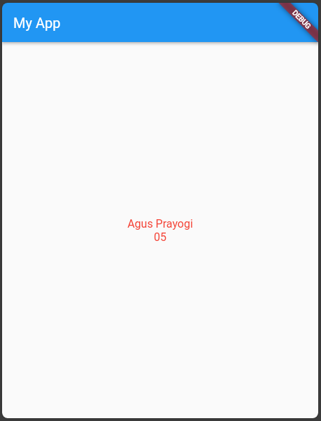
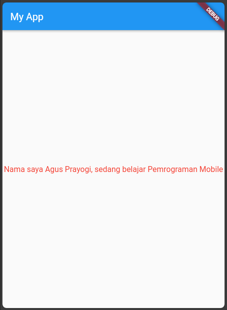
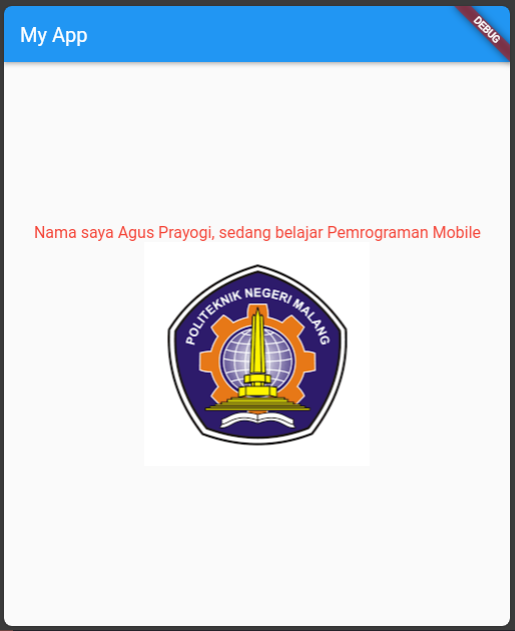
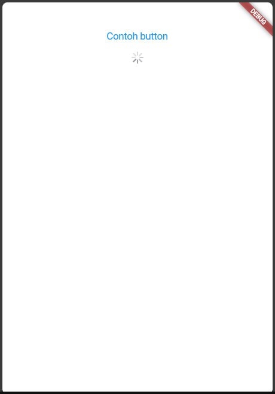
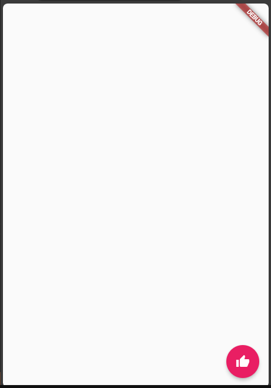
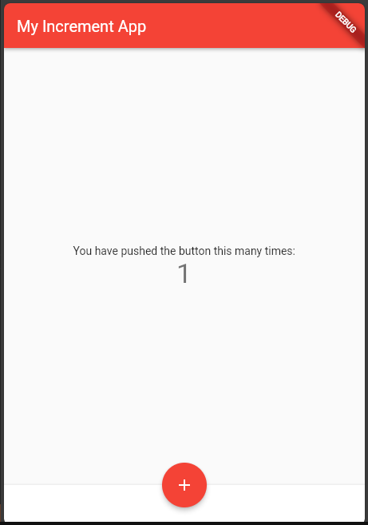
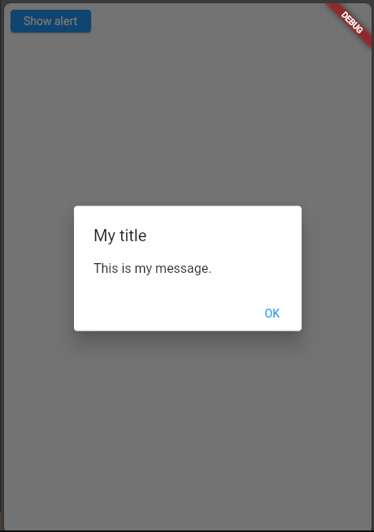
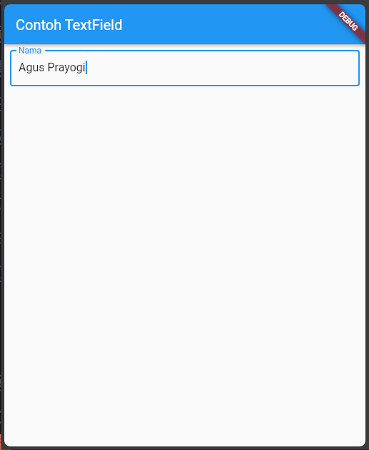
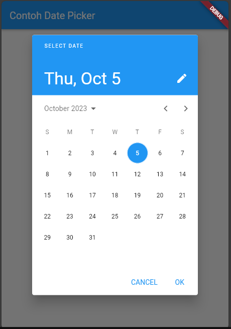

# Flutter Fundamental

* Nama  : Agus Prayogi
* NIM   : 2141720025
* Absen : 05
* Kelas : TI-3A

## Praktikum 2: Langkah Awal
Teks yang ditampilkan dalam aplikasi berupa nama lengkap, lalu simpan file screenshot dengan nama `01.png` pada folder images (buat folder baru jika belum ada) di project `flutter_basic` ini.

Code:
```dart
Column(
    mainAxisAlignment: MainAxisAlignment.center,
    crossAxisAlignment: CrossAxisAlignment.center,
    children: [
        Text(
            "Nama saya Agus Prayogi",
            style: TextStyle(color: Colors.red, fontSize: 16),
            textAlign: TextAlign.center,
        ),
        Text(
            "05",
            style: TextStyle(color: Colors.red, fontSize: 16),
            textAlign: TextAlign.center,
        ),
    ],
)
```


## Praktikum 3: Menerapkan Widget Dasar

1. Text Widget
* Buat folder baru `basic_widgets` di dalam folder lib. Kemudian buat file baru di dalamnya dengan nama `text_widget.dart`.

* kode untuk menampilkan text
```dart
Text(
    "Nama saya Agus Prayogi, sedang belajar Pemrograman Mobile",
    style: TextStyle(color: Colors.red, fontSize: 16),
    textAlign: TextAlign.center,
)
```


2. Image Widget
* Buat sebuah file `image_widget.dart` di dalam folder `basic_widgets`. Lakukan penyesuaian asset pada file `pubspec.yaml` dan tambahkan file logo Polinema di folder `assets`.

* kode untuk menampilkan image
```dart
Image(
    image: AssetImage("logo_polinema.png"),
    color: Colors.transparent,
)

```



## Praktikum 4: Menerapkan Widget Material Design dan iOS Cupertino

1. Cupertino Button dan Loading Bar
* Buat file di `basic_widgets` > `loading_cupertino.dart`. Import stateless widget dari material dan cupertino. 

* kode untuk menampilkan loading bar dan button
```dart
Container(
    margin: const EdgeInsets.only(top: 30),
    color: Colors.white,
    child: Column(
        children: <Widget>[
        CupertinoButton(
            child: const Text("Contoh button"),
            onPressed: () {},
        ),
        const CupertinoActivityIndicator(),
        ],
    ),
    )
```




2. Floating Action Button (FAB)
* Button widget terdapat beberapa macam pada flutter yaitu ButtonBar, DropdownButton, TextButton, FloatingActionButton, IconButton, OutlineButton, PopupMenuButton, dan ElevatedButton. 

* Buat file di `basic_widgets` > `fab_widget.dart`. Import stateless widget dari material.

* kode untuk menampilkan FAB
```dart
Scaffold(
    floatingActionButton: FloatingActionButton(
        onPressed: () {
        // Add your onPressed code here!
        },
        backgroundColor: Colors.pink,
        child: const Icon(Icons.thumb_up),
    ),
),
```



3. Scaffold Widget
* Scaffold widget digunakan untuk mengatur tata letak sesuai dengan material design.

* Buat file di `basic_widgets` > `scaffold_widget.dart`. Import stateless widget dari material.

* kode untuk menampilkan Scaffold
```dart
Scaffold(
    appBar: AppBar(
    title: Text(widget.title),
    ),
    body: Center(
    child: Column(
        mainAxisAlignment: MainAxisAlignment.center,
        children: <Widget>[
            const Text(
                'You have pushed the button this many times:',
            ),
            Text(
                '$_counter',
                style: Theme.of(context).textTheme.headline4,
            ),
        ],
    ),
    ),
    bottomNavigationBar: BottomAppBar(
        child: Container(
            height: 50.0,
        ),
    ),
    floatingActionButton: FloatingActionButton(
        onPressed: _incrementCounter,
        tooltip: 'Increment Counter',
        child: const Icon(Icons.add),
    ),
    floatingActionButtonLocation: FloatingActionButtonLocation.centerDocked,
)
```



4. Dialog Alert
* Dialog widget pada flutter memiliki dua jenis dialog yaitu `AlertDialog` dan `SimpleDialog`.

* Buat file di `basic_widgets` > `dialog_alert.dart`. Import stateless widget dari material.

* kode untuk menampilkan Dialog
```dart
class MyApp extends StatelessWidget {
  const MyApp({Key? key}) : super(key: key);

  @override
  Widget build(BuildContext context) {
    return const MaterialApp(
      home: Scaffold(
        body: MyLayout(),
      ),
    );
  }
}

class MyLayout extends StatelessWidget {
  const MyLayout({Key? key}) : super(key: key);

  @override
  Widget build(BuildContext context) {
    return Padding(
      padding: const EdgeInsets.all(8.0),
      child: ElevatedButton(
        child: const Text('Show alert'),
        onPressed: () {
          showAlertDialog(context);
        },
      ),
    );
  }
}

showAlertDialog(BuildContext context) {
  // set up the button
  Widget okButton = TextButton(
    child: const Text("OK"),
    onPressed: () {
      Navigator.pop(context);
    },
  );

  // set up the AlertDialog
  AlertDialog alert = AlertDialog(
    title: const Text("My title"),
    content: const Text("This is my message."),
    actions: [
      okButton,
    ],
  );

  // show the dialog
  showDialog(
    context: context,
    builder: (BuildContext context) {
      return alert;
    },
  );
}
```



5. Input dan Selection Widget
* Flutter menyediakan widget yang dapat menerima input dari pengguna aplikasi yaitu antara lain Checkbox, Date and Time Pickers, Radio Button, Slider, Switch, TextField.

* Buat file di `basic_widgets` > `textfield_widget.dart`. Import stateless widget dari material.

* kode untuk menampilkan Input
```dart
TextField(
    obscureText: false,
    decoration: InputDecoration(
        border: OutlineInputBorder(),
        labelText: 'Nama',
    ),
),
```



6. Date and Time Pickers
* Date and Time Pickers termasuk pada kategori input dan selection widget.

* Buat file di `basic_widgets` > `date_time_pickers.dart`. Import stateless widget dari material.

* kode untuk menampilkan Date and Time Pickers
```dart
class MyApp extends StatelessWidget {
  const MyApp({Key? key}) : super(key: key);

  @override
  Widget build(BuildContext context) {
    return const MaterialApp(
      title: 'Contoh Date Picker',
      home: MyHomePage(title: 'Contoh Date Picker'),
    );
  }
}

class MyHomePage extends StatefulWidget {
  const MyHomePage({Key? key, required this.title}) : super(key: key);

  final String title;

  @override
  _MyHomePageState createState() => _MyHomePageState();
}

class _MyHomePageState extends State<MyHomePage> {
  // Variable/State untuk mengambil tanggal
  DateTime selectedDate = DateTime.now();

  //  Initial SelectDate FLutter
  Future<void> _selectDate(BuildContext context) async {
    // Initial DateTime FIinal Picked
    final DateTime? picked = await showDatePicker(
        context: context,
        initialDate: selectedDate,
        firstDate: DateTime(2015, 8),
        lastDate: DateTime(2101));
    if (picked != null && picked != selectedDate) {
      setState(() {
        selectedDate = picked;
      });
    }
  }

  @override
  Widget build(BuildContext context) {
    return Scaffold(
      appBar: AppBar(
        title: Text(widget.title),
      ),
      body: Center(
        child: Column(
          mainAxisSize: MainAxisSize.min,
          children: <Widget>[
            Text("${selectedDate.toLocal()}".split(' ')[0]),
            const SizedBox(
              height: 20.0,
            ),
            ElevatedButton(
              onPressed: () => {
                _selectDate(context),
                // ignore: avoid_print
                print(selectedDate.day + selectedDate.month + selectedDate.year)
              },
              child: const Text('Pilih Tanggal'),
            ),
          ],
        ),
      ),
    );
  }
}
```

